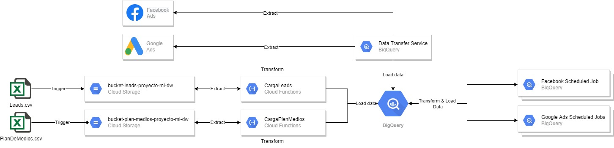
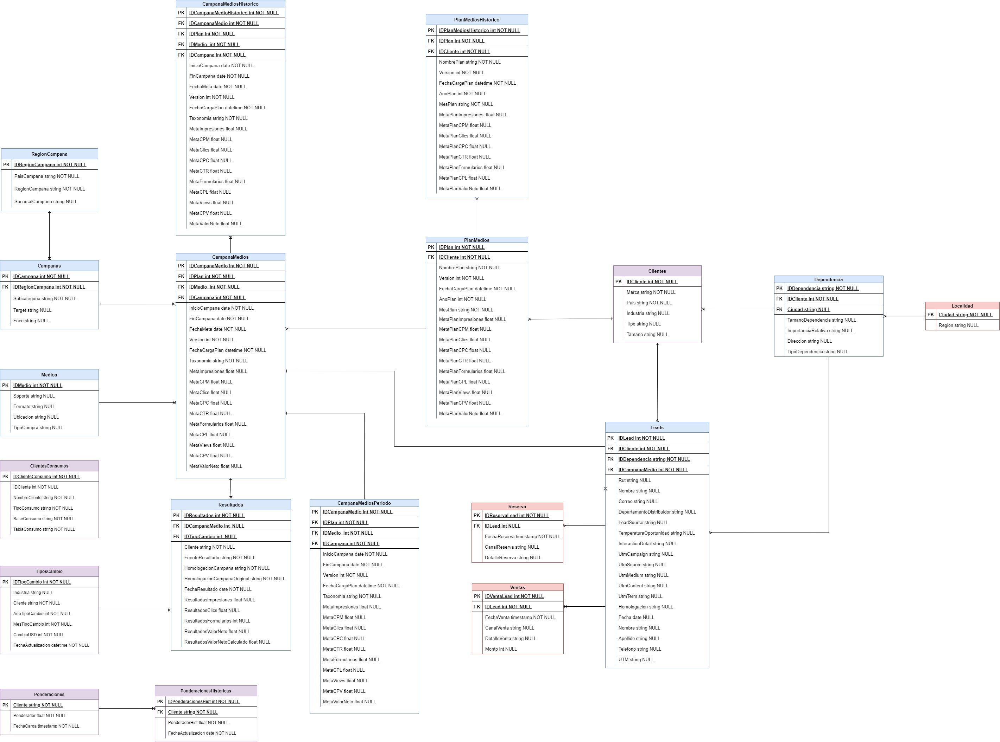

# Carga Automatizada Plan de Medios & Leads

Este repositorio contiene todo lo necesarios para configurar la carga automática a BigQuery de la información asociada al Plan de Medios y Leads de cualquier industria y cliente ligado a Fenomena *(Según el procedimiento y estructura actual de este tipo de archivos)*

## Solución y Componentes
El diseño de esta solución utiliza componentes asociados a la nube GCP, dada la necesidad de cargar esta información en BigQuery y visualizar los resultados por medio de Data Studio. A continuación un diagrama de la solución.

Las componentes que comprenden la solución son las siguientes:

**Cloud Storage**: Es un servicio para almacenar tus objetos en Google Cloud. Un objeto es un dato inmutable que consta de un archivo de cualquier formato. Los objetos se almacenan en contenedores llamados buckets. 

*En el proceso de carga automatizada, esta será la herramienta donde subiremos nuestros archivos de Leads y Plan de Medios*

**Cloud Function**: Es una solución de procesamiento serverless de GCP para crear aplicaciones controladas por eventos. 

*Esta es la componente que contiene el código que realiza la extracción, transformación y carga sobre BigQuery*

BigQuery: Es un almacén de datos (Data Warehouse) serverless totalmente administrado que permite un análisis escalable y con escala de petabytes.

*En este componente estructuramos y almacenamos nuestros datos, que le dan soporte a cualquier análisis posterior*

Por otro lado, se generó un modelo de datos que permita responder a una carga desagregada de los distintos elementos de información que contienen los archivos de Plan de Medios y Leads. Esto, con el objetivo a mediano/largo plazo, de ir abasteciendo un repositorio de información que permita generar un análisis más profundo y explorar nuevas formas de explotación. 

El siguiente diagrama refleja el modelo de datos establecido para lograr este objetivo.

Dentro de este modelo, las tablas marcadas en verde son cargadas con información mediante el proceso automatizado, en cambio las tablas en morado deben ser cargadas mediante un proceso manual (*son tablas con información no extraíble de los archivos de Plan de Medios o Leads*). Finalmente, tenemos las tablas en rojo que corresponden a tablas que debieran crearse pero aún no se tiene clara su estructura o la información a cargar en ellas (*son tablas poco críticas para el proceso actual*)

### ***Al ingresar en directorio CargaPlanMedios o CargaLeads de este repositorio, podrán ver más detalles del procedimiento de carga***
